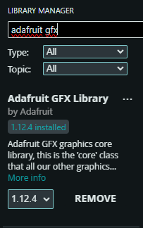

# TFT ST7735

## Librerías necesarias:
* [Adafruit GFX Library]

* [Adafruit ST7735 and ST7789 Library]

## Conexiones

|Pantalla TFT ST7735 |ESP32 |
|--------------------|------|
|BL                  |3.3V  |
|CS                  |5     |
|DC                  |16    |
|RES                 |17    |
|SDA                 |23    |
|SCK                 |14    |
|VCC                 |3.3V  |
|GND                 |GND   |

